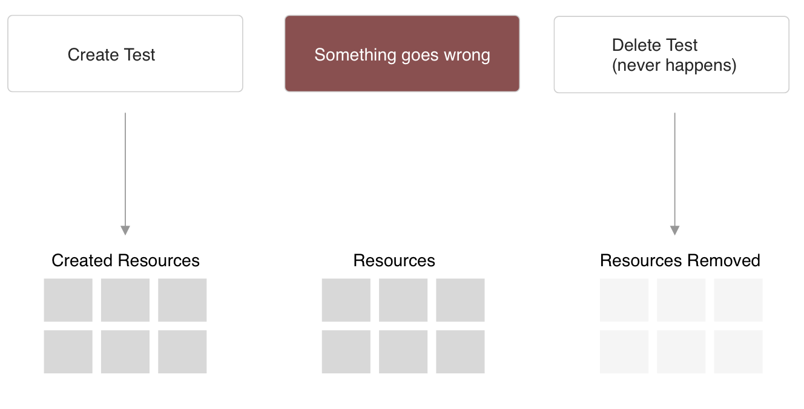
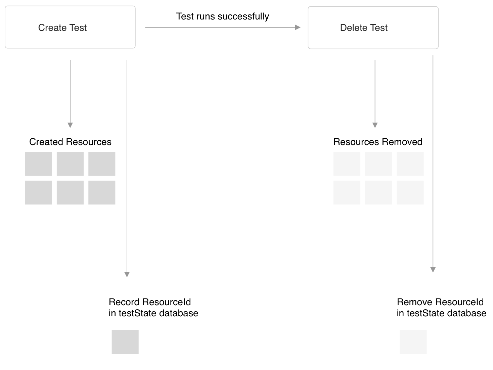
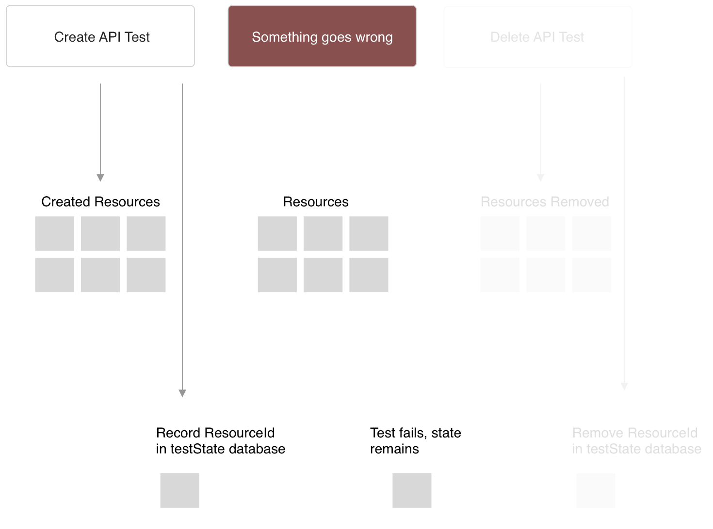

# Keeping track of failed test resources from Cypress Test runs

## Problem

Running Cypress tests often involve interacting with an app in such a way that artifacts are created on a backend service. If an E2E test fails, state may still exist on the backend that later needs to be cleaned up. If an E2E test is retried immediatly, the test may fail because of the resources from the previous test that did not get cleaned up.

In the image below, the expectation is that the delete test will take care of removing the resources, but something goes wrong in the middle and the delete test never gets run.

## Solution

Cypress allows you to add functionality in the form of plugins. One possible solution is to record test state in a dedicated DynamoDB database.

In this scenario, if the test runs as expected, the DynamoDB database will be empty. But if a problem does occur:

State will be left in the DynamoDB database.

# How it works in this project

In this project, every test run starts by checking the teststate db. If there is anything inside of it, the test fails immediatly.

The DynamoDB table has a TTL defined. It is possible to setup a AWS Lambda function to listen for TTL events and respond by cleaning up resources that were created by failed tests.

In this example, we have a Lambda Function triggered by a cron running every 60 seconds. This Lambda will scan the teststate table, and kick off a "remove resources" workflow (which in this example means just removing an item from the TestApplication db).

This ensures that if tests fail, future tests cannot run until resources are cleaned up, and the 60 second cron Lambda ensures that these resources will be cleaned up promptly and not block or CI Pipeline for too long.
